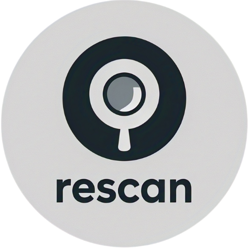
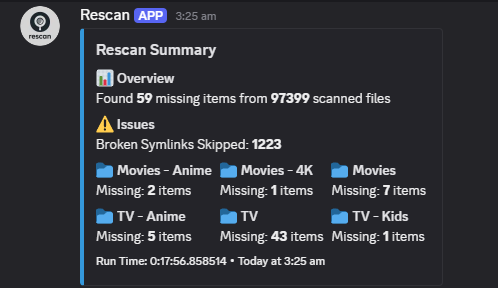

<div align="center">
  <a href="https://github.com/Pukabyte/rescan">
    <picture>
      <source media="(prefers-color-scheme: dark)" srcset="assets/logo.png" width="400">
      
    </picture>
  </a>
</div>

<div align="center">
  <a href="https://github.com/Pukabyte/rescan/stargazers"></a>
  <a href="https://github.com/Pukabyte/rescan/issues"></a>
  <a href="https://github.com/Pukabyte/rescan/blob/main/LICENSE"></a>
  <a href="https://github.com/Pukabyte/rescan/graphs/contributors"></a>
  <a href="https://discord.gg/vMSnNcd7m5"></a>
</div>

<div align="center">
  <p>Keep your Plex libraries in sync with your media files.</p>
</div>

# Rescan

Scan your Plex media libraries for missing files and triggers rescans when needed.<br/>
This is a good once over in case your autoscan tool misses an import or an upgrade from your *arr<br/> 
It can also provide Discord notification summaries.<br/>



## Features

- Scans specified directories for media files
- Checks if files exist in Plex libraries
- Triggers Plex rescans for missing items
- Sends Discord notifications with detailed summaries
- Supports both movie and TV show libraries
- Configurable scan intervals and behavior
- Docker support for easy deployment

## Prerequisites

- Python 3.11 or higher
- Plex Media Server
- Discord webhook URL (for notifications)

## Installation

### Docker (Recommended)

1. Clone the repository:
```bash
git clone https://github.com/Pukabyte/rescan.git
cd rescan
```

2. The application will create a default `config.yaml` in the `/app/config` volume on first run. Alternatively, you can create it manually:
```bash
cp config.example.yaml /path/to/your/config/config.yaml
```

3. Edit `config.yaml` with your settings. You must provide your Plex token and media directories.

4. Run with Docker Compose (example):
```yaml
services:
  rescan:
    image: ghcr.io/lmgveerhoek/rescan:latest # Use the image we built
    container_name: rescan
    restart: unless-stopped
    volumes:
      - /path/to/your/config:/app/config
      - /path/to/your/media:/media # Ensure this path matches your media folders
      - /etc/localtime:/etc/localtime:ro
    environment:
      - RESCAN_PLEX__TOKEN=YOUR_PLEX_TOKEN_HERE # Optional: use environment variables
```

### Manual Installation

1. Clone the repository:
```bash
git clone https://github.com/Pukabyte/rescan.git
cd rescan
```

2. Install dependencies:
```bash
pip install -r requirements.txt
```

3. Copy and configure the config file:
```bash
cp config.example.json config.json
```

4. Edit `config.json` with your settings.

5. Run the script:
```bash
python3 rescan.py
```

## Configuration

The application is configured via a `config.json` file or environment variables (prefixed with `RESCAN_`).

### `config.yaml` Example
```yaml
# ------------------ Plex Settings ------------------
plex:
  server: http://localhost:32400
  token: YOUR_PLEX_TOKEN_HERE

# ------------------ Log Settings -------------------
logs:
  loglevel: INFO

# ---------------- Behaviour Settings ---------------
behaviour:
  scan_interval: 5
  run_interval: 24
  symlink_check: true

# --------------- Notification Settings -------------
notifications:
  enabled: true
  discord_webhook_url: null # or "https://your_webhook_url"

# ------------------ Scan Settings ------------------
scan:
  directories:
    - /media/movies
    - /media/tv
```

## Discord Notifications

The script sends detailed notifications to Discord including:
- Overview of missing items
- Library-specific statistics
- Broken symlinks (if enabled)
- Errors and warnings

## Contributing

1. Fork the repository
2. Create your feature branch (`git checkout -b feature/amazing-feature`)
3. Commit your changes (`git commit -m 'Add some amazing feature'`)
4. Push to the branch (`git push origin feature/amazing-feature`)
5. Open a Pull Request

## License

This project is licensed under the MIT License - see the LICENSE file for details.

## Acknowledgments

- [PlexAPI](https://github.com/pkkid/python-plexapi) for Plex server interaction
- [Discord.py](https://github.com/Rapptz/discord.py) for Discord webhook support
- [Pydantic](https://pydantic-docs.helpmanual.io/) for robust settings management
- [PyYAML](https://pyyaml.org/) for YAML parsing. 